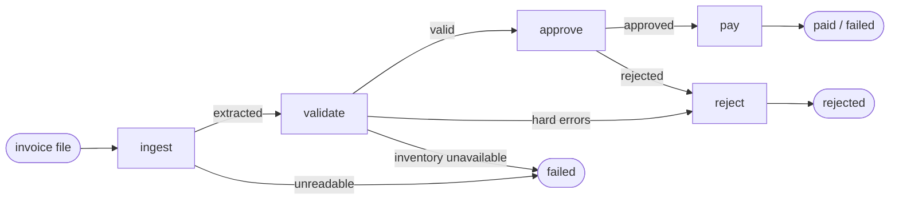

# Invoice Processing Automation

[](https://github.com/gabebed/Galatiq-Technical-Assessment/actions/workflows/tests.yml)

A multi-agent system that takes messy invoices (PDF, TXT, CSV, JSON, XML), extracts them, validates them
against inventory, puts them through a reflective approval review, and pays the approved ones, with an
audit trail for every decision.

**Design principle:** LLM agents (xAI Grok) do the *judgement* work; deterministic, tested code does
anything that touches *data or money*. The agents can investigate, explain, and be stricter than policy.
They cannot change inventory, relax policy, or move money that was not explicitly approved.

> Built for the Galatiq case study. The original brief is in [docs/ASSIGNMENT.md](docs/ASSIGNMENT.md).

---

## Contents

- [The business problem](#the-business-problem)
- [Results on the sample invoices](#results-on-the-sample-invoices)
- [Quick start](#quick-start)
- [Usage](#usage)
- [Examples: a normal and a problematic invoice](#examples)
- [Architecture](#architecture)
- [Agents and tools](#agents-and-tools)
- [The approval reflection loop](#the-approval-reflection-loop)
- [Payment safety: no payment without explicit approval](#payment-safety)
- [Database](#database)
- [LLM integration](#llm-integration)
- [Observability](#observability)
- [Testing](#testing)
- [Project structure](#project-structure)
- [Design decisions and trade-offs](#design-decisions-and-trade-offs)
- [Known limitations](#known-limitations)

---

## The business problem

Acme Corp loses **~$2M/year** on manual invoice processing: a **30% error rate**, **5-day delays**, VP
approvals buried in email chains, and invoices that are messy, incomplete, or fraudulent.

| Pain point | What this system does |
|---|---|
| Manual data entry from inconsistent formats | Deterministic extraction from 5 formats and many layouts (abbreviated labels, email bodies, scan-damaged text, multi-line tables). Anything it cannot read confidently is flagged, never guessed. |
| Errors reaching payment | 8 groups of checks covering 12 issue types: inventory and stock, quantities, line and total arithmetic, dates, currency, fraud language. Two of the provided invoices have **wrong totals** that a human could easily miss; both are caught. |
| Fraud | Unknown or zero-stock items, pressure language ("URGENT… wire transfer"), and invalid data are rejected with an explanation. |
| Slow, opaque VP approval | Policy-driven approval with the $10K scrutiny rule, plus an optional Grok "VP" agent whose reasoning is critiqued and revised before a decision. Every decision carries its reasoning. |
| Payment mistakes | Payment only for an explicit approval of the *exact* vendor, amount, and currency; duplicate and revised invoices are never paid twice. |

---

## Results on the sample invoices

`python main.py --invoice_path=data/invoices/ --llm=off` over the 20 provided files:

| Outcome | Invoices | Why |
|---|---|---|
| **Paid (8)** | 1001, 1004, 1006, 1010, 1011, 1012, 1014, 1015 | Valid and approved. 1012 is paid despite scan damage (`2O26`, `$3,500.O0`), which is corrected and flagged; 1014 is EUR, so it gets additional scrutiny. |
| **Rejected (9)** | 1002, 1005, 1007, 1013 (JSON and PDF) | Quantity exceeds stock (1013 only once its repeated lines are added together) |
| | 1003 | FakeItem has zero stock, plus fraud signals |
| | 1008, 1016 | Items not in inventory |
| | 1009 | Negative quantity, missing vendor, totals that contradict each other |
| | 1007, 1013 | Also: stated totals are wrong ($110 low, $50 high) |
| **Not paid: duplicates (3)** | 1004 revised, 1011.txt, 1012.txt | Same invoice number as an invoice already paid this run. Flagged for manual reconciliation. |

All six README scenarios behave as specified. The full per-invoice analysis, including where the provided
files go beyond the README's scenario table, is in [docs/INVOICE_ANALYSIS.md](docs/INVOICE_ANALYSIS.md).

---

## Quick start

Requires **Python 3.11+**. CI runs the suite on Python 3.11–3.13, on Linux and Windows.

```bash
git clone https://github.com/gabebed/Galatiq-Technical-Assessment.git
cd Galatiq-Technical-Assessment

python -m venv .venv
source .venv/bin/activate          # Windows PowerShell: .venv\Scripts\Activate.ps1

pip install -e ".[dev]"            # installs the package, its dependencies, and pytest
python scripts/init_db.py          # creates ./inventory.db with the seed inventory

python main.py --invoice_path=data/invoices/            # process every sample invoice
python -m pytest                                        # run the test suite (offline)
```

The system runs **fully offline** by default. To enable the Grok agents, set an API key:

```bash
export XAI_API_KEY="your-key"       # Windows PowerShell: $env:XAI_API_KEY = "your-key"
python main.py --invoice_path=data/invoices/invoice_1001.txt --llm=on
```

### Environment variables

| Variable | Default | Purpose |
|---|---|---|
| `XAI_API_KEY` | *(unset)* | xAI API key. Read only from the environment; never logged or written to disk. If unset, the system runs deterministically. |
| `LLM_PROVIDER` | `xai` | LLM provider (see [LLM integration](#llm-integration)). |
| `LLM_MODEL` | `grok-4.7` | Model id. |
| `LLM_TIMEOUT_SECONDS` | `60` | Per-request timeout. |
| `RUN_LIVE_LLM_TESTS` | *(unset)* | Set to `1` to run the tests that call the real xAI API. |

`.env` files are git-ignored, but they are **not** loaded automatically; export the variables in your shell.

---

## Usage

```bash
python main.py --invoice_path=data/invoices/                       # a whole directory
python main.py --invoice_path=data/invoices/invoice_1003.txt       # one file
python main.py --invoice_path=data/invoices/ --llm=off             # force deterministic mode
python main.py --invoice_path=data/invoices/ --json > results.json # machine-readable results
python main.py --invoice_path=data/invoices/ -v --log-format=json  # structured logs on stderr
invoice-processor --invoice_path=data/invoices/                    # same CLI, installed as a command
```

| Option | Description |
|---|---|
| `--invoice_path` | Invoice file or directory (`.pdf .txt .json .csv .xml`). Required. |
| `--db-path` | SQLite inventory database (default `inventory.db` in the project root). |
| `--llm {auto,on,off}` | `auto` (default) uses the Grok agents only when `XAI_API_KEY` is set. |
| `--json` | Print structured JSON results instead of the human-readable report. |
| `-v` / `-vv` | Info / debug logs on stderr. |
| `--log-format {text,json}` | Log format; `json` emits one object per line, tagged with the invoice. |
| `--llm-log` / `--no-llm-log` | Show every LLM request: a start/end line on stderr and an **LLM CALLS** table per invoice (default: on). `--no-llm-log` hides successful requests; failed requests and **LLM FAILURES** are always shown. |

**Exit codes:** `0` all paid · `1` at least one rejected · `2` invalid input or setup (bad path, missing
database or API key) · `3` at least one invoice could not be processed (unreadable file, payment failure,
duplicate) · `4` unexpected internal error · `130` interrupted.

---

<a id="examples"></a>
## Examples: a normal and a problematic invoice

### A normal invoice: INV-1001 → paid

```text
$ python main.py --invoice_path=data/invoices/invoice_1001.txt --llm=off
====================================================================================================
INV-1001  |  invoice_1001.txt                                                                   PAID
====================================================================================================
EXTRACTION
  Vendor        Widgets Inc.
  Invoice date  2026-01-15
  Due date      2026-02-01
  Terms         Net 15
  Currency      USD
  Items
    WidgetA               10 x      250.00  =     2,500.00
    WidgetB                5 x      500.00  =     2,500.00
  Amounts       Subtotal 5,000.00   Tax 0.00   Total 5,000.00 USD

VALIDATION  PASSED  (0 errors, 0 warnings)

APPROVAL  APPROVED  (standard review; reviewer: rule-based-approver)
  Total $5,000.00 is within the $10,000.00 threshold; standard review applies.
  Validation passed with no issues.
  Approved for payment.

PAYMENT  PAID  5,000.00 USD to Widgets Inc.
  Transaction   MOCK-164CB74BDCBA
```
Exit code `0`.

### A problematic invoice: INV-1003 → rejected, payment skipped

The source text: `Vendor: Fraudster LLC`, `Due Date: yesterday`, `FakeItem qty: 100`,
`Notes: URGENT - Pay immediately to avoid penalties!!! Wire transfer preferred.`

```text
$ python main.py --invoice_path=data/invoices/invoice_1003.txt --llm=off
====================================================================================================
INV-1003  |  invoice_1003.txt                                                               REJECTED
====================================================================================================
EXTRACTION
  Vendor        Fraudster LLC
  Invoice date  2026-01-20
  Due date      -
  Terms         Immediate
  Currency      USD
  Items
    FakeItem             100 x    1,000.00  =   100,000.00
  Amounts       Subtotal -   Tax -   Total 100,000.00 USD
  ! due_date: could not parse 'yesterday' as a date

VALIDATION  FAILED  (1 error, 2 warnings)
  ERROR   [out_of_stock] FakeItem has zero stock, but the invoice bills 100 units. Billing for an
          item with no inventory is a possible fraud signal.
  WARNING [extraction_uncertain] Extraction uncertainty - due_date: could not parse 'yesterday' as a
          date. Verify against the source document.
  WARNING [suspicious_content] Invoice uses pressure language (immediate, immediately, penalties,
          urgent, wire transfer), a common pattern in payment fraud.

APPROVAL
  Not reached: invoice failed validation.

PAYMENT  SKIPPED
  Payment was not attempted: the invoice was rejected at validation.
```
Exit code `1`. The unreadable due date becomes *missing plus a warning* rather than a guess, and the
payment function is never reached.

### With the Grok agents: INV-1012 (scan damage, $9,975), excerpt

`python main.py --invoice_path=data/invoices/invoice_1012.pdf --llm=on`. Real output; long lines are
shortened with `...`.

```text
VALIDATION  PASSED  (0 errors, 2 warnings)
  WARNING [extraction_uncertain] ... corrected OCR artifact '$3,500.O0' -> '$3,500.00' ...
  WARNING [extraction_uncertain] ... corrected OCR artifact '26-Jan-2O26' -> '26-Jan-2026' ...
  Agent review: All three line items (WidgetA x12, WidgetB x7, GadgetX x4) match stocked inventory
  names exactly and are within available stock (15, 10, and 5 respectively). ...

APPROVAL  APPROVED  (standard review; reviewer: llm-approval-agent)
  Approved. Currency is USD and the total is present and positive at $9,975.00, which is not
  strictly greater than $10,000.00, so additional scrutiny is not required ... Two unresolved
  extraction_uncertain WARNINGs were considered and do not block approval outside additional
  scrutiny: (1) items[1].line_total OCR correction '$3,500.O0' -> '$3,500.00'; (2) ...
  Flags: warning:extraction_uncertain, llm_reviewed
  Review trail (2 steps):
    Draft 1: APPROVED (no scrutiny). Approved. Currency is USD and the total is present and posit...
    Critique 1: no issues found.

PAYMENT  PAID  9,975.00 USD to QuickShip Distributers
  Transaction   MOCK-E07952581774

AGENT TOOL CALLS  7 (0 refused)
  validation.lookup_inventory({"item":"WidgetA"}) -> ok
  ...
  validation.check_stock({"item":"GadgetX","quantity":4}) -> ok
  payment.mock_payment({"vendor":"QuickShip Distributers","amount":9975.0}) -> ok

LLM CALLS  8 request(s) to xai/grok-4.7: 8 ok, 0 failed | tokens 18,423 in / 707 out | cost $0.0400
  #   time      agent            operation          secs   tokens in->out  structured     result
  1   16:56:38  validation       tool_round         12.1        2,254->81  not_requested  ok
      request id 84ad4ae4-712d-96ad-b7dc-6d7963b554e8
  ...
  4   16:57:20  approval:draft   structured         12.2       2,210->273  parsed         ok
      request id 6d7e8de0-7571-93c5-8b8c-1ff84b36e68d
  5   16:57:32  approval:critic  structured          5.6         2,735->5  parsed         ok
      request id c469b0f5-aeeb-998e-964f-8e5e6a9b1a57
  ...
  8   16:57:55  payment          final_structured    2.5        1,933->42  parsed         ok
      request id e6a22371-ae1b-909e-8576-52177f6fdfdd
```

At the same time, stderr shows a START line and an OK line for each of the 8 requests, e.g.
`LLM request #4 START  agent=approval:draft provider=xai model=grok-4.7 op=structured schema=ApprovalDraft`.

---

## Architecture



The workflow is a [LangGraph](https://github.com/langchain-ai/langgraph) `StateGraph`
([workflow.py](src/invoice_processor/workflow.py)). Each node is a thin adapter around a stage module.
Stages communicate only through typed Pydantic models ([models.py](src/invoice_processor/models.py)):

```
file path → Invoice → ValidationResult → ApprovalResult → PaymentResult
```

| Stage | Deterministic core | LLM agent (optional) |
|---|---|---|
| **Ingestion** ([ingestion/](src/invoice_processor/ingestion)) | Format-specific parsers (pdfplumber for PDFs) feed one normalizer: money as `Decimal`, 10 date formats, scan-damage fixes, item-name normalization. Unreadable values become `None` plus a warning. | — |
| **Validation** ([validation.py](src/invoice_processor/validation.py)) | 8 check groups against SQLite and the invoice's own arithmetic; ERROR blocks, WARNING informs approval. | Reviews passing invoices with read-only inventory tools. **Advisory only.** |
| **Approval** ([approval.py](src/invoice_processor/approval.py), [approval_agent.py](src/invoice_processor/approval_agent.py)) | `RuleBasedApprover`: hard failures, the $10K scrutiny rule, blocking warnings. | Grok "VP" agent with a draft → critique → revise loop. Constrained by the rules. |
| **Payment** ([payment.py](src/invoice_processor/payment.py)) | `authorize_payment` → `mock_payment`, behind a duplicate guard. | Executes the authorized payment via its single bound tool. |

Detailed design (state, contracts, failure handling, module map):
[docs/ARCHITECTURE.md](docs/ARCHITECTURE.md).

---

## Agents and tools

**What counts as an agent here:** a component whose output is produced by the LLM, through its own prompt
and output structure, optionally with tools. There are **three agents**, and the approval agent also runs a
**critic role**.

- **Agents run only in LLM mode:** `--llm=on`, or the default `auto` with `XAI_API_KEY` set. Without a key,
  the same graph runs fully deterministically.
- **Agents never call each other.** LangGraph routes between nodes based on deterministic results, and
  each agent runs inside one node.

| Agent | Node · implementation | When it runs | Input | Output | Tools | Can it change the outcome? |
|---|---|---|---|---|---|---|
| **Validation** | `validate` · `agents.review_validation` | Only after deterministic validation passed | Invoice + validation result | `ValidationReview` (summary, concerns) | `lookup_inventory`, `check_stock` | No. Advisory: shown in the report, not consumed downstream. |
| **Approval** (+ critic role) | `approve` · `approval_agent.LLMApprover` | Every valid invoice | Invoice, validation result, policy text. The critic also gets the policy engine's decision as facts. | `ApprovalResult` with the full `review_trail` | None | Only to be **stricter**: it may reject what policy approves, never the reverse. |
| **Payment** | `pay` · `agents.run_payment_agent` | Only after `authorize_payment` succeeded | The `PaymentAuthorization` only (no invoice text) | `PaymentResult` recorded from what the tool executed | `mock_payment`, bound to the authorization | No. It can pay only the authorized vendor and amount, once. |

**Deliberately *not* agents:** these are deterministic and tested.

- ingestion (`extract_invoice`)
- the validation checks (`validate_invoice`)
- the policy engine (`RuleBasedApprover`)
- the payment gate (`authorize_payment`)

The exact inventory of components, with an execution diagram, is in
[docs/ARCHITECTURE.md](docs/ARCHITECTURE.md#7-agents).

**How tools are protected.** Each agent receives a `Toolset` containing **only its own tools**; tools are
never handed to the model as raw functions. Every call goes through `Toolset.invoke`
([tools.py](src/invoice_processor/tools.py)), which:

- rejects tools outside the agent's set
- validates arguments against a strict Pydantic model (unknown fields rejected)
- enforces a call budget
- logs the call and records it in the run's audit trail
- returns a structured `ToolResult(ok, data | error)` instead of raising

No agent has a SQL tool, a code-execution tool, or another agent's tools.

---

## The approval reflection loop

[approval_agent.py](src/invoice_processor/approval_agent.py), `LLMApprover`:

1. **Draft.** Grok reviews the invoice, the validation result, and the written policy, and returns a
   structured `ApprovalDraft` (decision, scrutiny, reasoning).
2. **Critique.** Each draft is checked by
   - **deterministic checks**, which reliably catch the four failure types:
     - `policy_violation`: approving what the policy rejects
     - `scrutiny_rule`: misreading "strictly greater than $10,000"
     - `missed_validation_issue`: a validation issue the reasoning doesn't address
     - `insufficient_justification`: reasoning too thin to support the decision
   - **an LLM critic** for judgement-based findings. It is given the policy engine's result as
     authoritative facts.
3. **Revise.** If there are findings, Grok revises its draft against them.
4. **Bounded.** At most 2 critique rounds (≤ 5 model calls per invoice).
5. **Constrained.**
   - The final decision is never more lenient than `RuleBasedApprover`.
   - Scrutiny always comes from policy.
   - `approve_invoice` then enforces the hard rules on top.
   - If the LLM fails in any way, the deterministic decision is used and flagged `llm_unavailable`.

Every draft and critique is kept in `ApprovalResult.review_trail`. Tests in
[test_approval_agent.py](tests/test_approval_agent.py) show the critique correcting wrong first drafts:
a policy violation, the scrutiny rule misread at exactly $10,000.00 and at $15,000, and missed scan-damage
warnings on the real INV-1012.

---

<a id="payment-safety"></a>
## Payment safety: no payment without explicit approval

The central invariant is enforced in layers, so no single bug or misbehaving agent can break it:

0. **Clean input.** The workflow accepts only `invoice_path`. Any `invoice`, `validation`, or `approval`
   passed into `workflow.invoke()` is dropped, and routing stops on a failed stage, so every result in
   state was produced by the graph itself.
1. **Routing.** The graph reaches `pay` only from an APPROVED approval.
2. **Authorization.** `authorize_payment` re-checks everything rather than trusting earlier stages. It
   issues a `PaymentAuthorization` only if all of these hold:
   - the approval is a genuine, strictly valid `ApprovalResult`; dicts, strings, look-alike objects, and
     unvalidated `model_construct()` objects are refused
   - an APPROVED decision exists, for **this** invoice number
   - the decision was made on the **exact** vendor, amount, and currency (so an approval of INV-1004 cannot
     pay its revised, $4,050 larger version)
   - validation passed
   - the invoice has a positive total and a vendor
3. **A single call site.** Only `execute_authorized_payment` calls the payment function. A test parses
   the source code to enforce this.
4. **A bound tool.** The payment agent's tool pays only its authorization's values, once.
5. **Approval overrides.** Any approver output that is malformed, or that approves a hard failure, a
   different invoice, or different terms, is overridden to REJECTED.
6. **Duplicate guard.** A workflow never pays the same invoice number twice.
7. **Failure handling.** If anything fails after money moved, the tool's record of the payment is kept,
   so it is never re-paid on retry.

Three test files prove this:

- **[test_qa_invariants.py](tests/test_qa_invariants.py)** runs every combination of 8 approval states, 6
  invoice defects, valid/invalid validation, and both payment paths (192 cases). Payment happens in
  exactly one combination.
- **[test_payment_gate_audit.py](tests/test_payment_gate_audit.py)** counts calls to the real default
  payment path, the one the CLI uses. It shows that rejected invoices, failed validations, malformed
  approvals, and forged workflow input never pay, and that approved invoices pay exactly once.
- **[test_agent_safety.py](tests/test_agent_safety.py)** runs adversarial agents that try to pay "Evil
  Corp", inflate amounts, call SQL/Python tools, and inject SQL.

---

## Database

SQLite at `inventory.db` (git-ignored, created by `python scripts/init_db.py`):

```sql
CREATE TABLE inventory (item TEXT PRIMARY KEY, stock INTEGER NOT NULL CHECK (stock >= 0));
-- seed: WidgetA 15, WidgetB 10, GadgetX 5, FakeItem 0
```

- **Rerunnable setup.** `init_db` can be re-run safely and resets seed stock (`--reset` also drops extra
  items).
- **Read-only at runtime.** Validation and the agents use a read-only connection (`mode=ro`).
- **Fails closed.** A missing or corrupt database, or a NULL, text, or negative stock value, raises
  `InventoryDatabaseError` and the invoice is marked failed. It is never treated as valid.
- **Stock rule.** Repeated lines for the same item are added together and compared to stock. Quantity
  equal to stock passes. Stock is not decremented across invoices.

---

## LLM integration

- **SDK.** The official [`xai-sdk`](https://docs.x.ai) (gRPC), not the brief's outdated
  `from xai import Grok` example. The default model is `grok-4.7`, which xAI lists as its current default.
- **Structured outputs everywhere.** Every model call goes through `chat.parse(PydanticModel)`.
  Malformed output becomes an `LLMError` and falls back to the safe deterministic path.
- **Swappable provider.** The application depends only on the `LLMClient` interface
  ([llm/base.py](src/invoice_processor/llm/base.py)). Adding a provider means one class and one entry in
  `llm.PROVIDERS`.
- **Offline first.** The brief says to assume no internet. With no key, or with `--llm=off`, the full
  pipeline runs deterministically with identical safety guarantees.
- **Privacy.** In LLM mode, extracted invoice data is sent to xAI. The payment agent never sees invoice
  free text, so prompt injection in invoice notes cannot reach it (this is tested).

Measured in LLM mode: an approved invoice takes 8 requests (3 validation, draft, critique, 3 payment)
and costs about $0.03–0.04. Wall time ranged from about 30 seconds to over a minute, depending on xAI
latency. Invoices rejected at validation make no LLM calls.

---

## Observability

- **Report** (stdout). Per-invoice extraction, issues, decision with reasoning, payment, agent tool
  calls, and a batch summary.
- **`--json`.** The complete structured state for each invoice: `Invoice`, `ValidationResult`,
  `ApprovalResult` (including its review trail), `PaymentResult`, and every tool call record.
- **Logs** (stderr, `-v`). Every line is tagged with the invoice being processed; `--log-format=json`
  gives one JSON object per line:
  ```json
  {"ts": "2026-10-05T20:35:04.983+00:00", "level": "INFO", "logger": "invoice_processor.validation",
   "invoice": "invoice_1002.txt", "message": "Validated INV-1002: INVALID (1 errors, 1 warnings)"}
  ```
  Logs cover each stage, every tool call (with refusals), approval overrides, per-invoice timing, and a
  run summary.
- **LLM requests.** Every request to xAI is logged by the client wrapper itself
  ([llm/telemetry.py](src/invoice_processor/llm/telemetry.py)), with one line immediately before the API
  call and one immediately after. Each line includes:
  - agent, provider, and model
  - start and completion time
  - whether the call succeeded
  - the xAI request ID
  - token usage and cost
  - whether the structured output parsed

  In LLM mode these lines appear on stderr even without `-v`, and the report lists them per invoice under
  **LLM CALLS**. Use `--no-llm-log` to hide them:
  ```text
  LLM request #4 START  agent=approval:draft provider=xai model=grok-4.7 op=structured schema=ApprovalDraft
  LLM request #4 OK agent=approval:draft provider=xai model=grok-4.7 op=structured structured=parsed
      id=9e46d08a-9357-9325-bf64-8480b2a9b74d tokens=1877->201 cost_usd=0.006532 duration_ms=8656
  ```
  Prompts, model output, and API keys are never logged. Schema failures record only the failing field
  paths.
- **LLM failures are never silent.** Failed requests are logged at ERROR. Each affected invoice gets an
  **LLM FAILURES** section, for example "Approval agent failed; the deterministic policy decision was
  used", or "Payment agent failed; the invoice was NOT paid". The run ends with a warning on stderr,
  which is printed at any verbosity.

---

## Testing

```bash
python -m pytest                                    # 672 offline tests, ~15 s, no network
python -m pytest tests/test_qa_invariants.py tests/test_payment_gate_audit.py -q   # payment safety only
RUN_LIVE_LLM_TESTS=1 python -m pytest -m live       # 3 tests against the real xAI API (needs XAI_API_KEY)
```

| Area | Tests | Highlights |
|---|---|---|
| Safety invariants | 225 | 192-case approval/payment combinations; code-structure checks on payment call sites; LLM crashes and invalid output at every stage; prompt injection; malformed files; corrupt databases |
| Payment gate audit | 86 | Counts calls to the real default payment path: rejected / invalid / malformed / forged input → never paid; approved → paid exactly once |
| Ingestion | 78 | Every sample file's expected fields; scan damage; truncated, re-encoded, and empty files |
| Tools and agent safety | 60 | Allowlists, argument validation, budgets, SQL injection, adversarial agents |
| Approval and reflection loop | 52 | Threshold boundaries, overrides, critique corrections, iteration limits |
| Validation | 40 | All six README scenarios and every sample file against the analysis matrix |
| LLM client and telemetry | 28 | Structured output, tool loop, one logged record per real request, no keys or prompts in logs, visible failures, `--llm-log` |
| Workflow, payment, CLI, other | 103 | Graph routing, equivalence with the direct pipeline, exit codes, JSON output, logging, database |

Malformed-file tests use damaged copies of the real sample invoices rather than invented content.
CI ([.github/workflows/tests.yml](.github/workflows/tests.yml)) runs the suite on Linux and Windows,
Python 3.11–3.13.

---

## Project structure

```
├── main.py                       CLI entry point (python main.py --invoice_path=...)
├── scripts/init_db.py            Create / reset the SQLite inventory
├── data/invoices/                The 20 provided sample invoices (unchanged)
├── docs/
│   ├── ARCHITECTURE.md           Detailed design, contracts, failure handling
│   ├── INVOICE_ANALYSIS.md       Per-invoice edge-case matrix and README discrepancies
│   └── ASSIGNMENT.md             The original case brief
├── src/invoice_processor/
│   ├── models.py                 Pydantic contracts between stages
│   ├── ingestion/                Format parsers + shared normalizer → Invoice
│   ├── database.py, inventory.py SQLite setup and read-only lookups
│   ├── validation.py             Deterministic checks → ValidationResult
│   ├── approval.py               Policy, Approver interface, hard-rule enforcement
│   ├── approval_agent.py         Grok approval agent with critique loop
│   ├── payment.py                Authorization, mock payment, duplicate guard
│   ├── tools.py, agent_tools.py  Tool framework and per-agent toolsets
│   ├── agents.py                 Validation and payment agents
│   ├── llm/                      Provider-agnostic LLM client, xAI implementation, request telemetry
│   ├── workflow.py               LangGraph state machine
│   ├── cli.py, report.py         Command line and rendering
│   └── observability.py          Invoice-tagged text/JSON logging
└── tests/                        675 tests (3 live, opt-in)
```

---

## Design decisions and trade-offs

- **Deterministic extraction first, not LLM extraction.** The sample formats are parseable by rules,
  which makes the result reproducible, free, offline, and testable against every file. The trade-off is
  that an unseen label (e.g. `Supplier:`) produces a missing field plus warnings rather than a guess.
  LLM-assisted extraction for incomplete results is the natural next step; its output would still go
  through the same normalizer and validation.
- **Extraction records, validation judges.** The `Invoice` model accepts negative quantities and wrong
  totals so validation can report them. Extraction never crashes on bad business data.
- **The LLM can only make outcomes stricter.** Policy is the floor. This keeps the system predictable for
  finance while still using the model's judgement.
- **Approvals are bound to terms**, not just invoice numbers, because revised invoices reuse numbers
  (INV-1004).
- **Stock is checked on combined quantities against fixed stock.** Otherwise INV-1013 passes line by
  line while over-billing every item. Decrementing stock across invoices would make results depend on
  processing order.
- **Two outcomes, not three.** "Needs manual review" is currently REJECTED with a reason and flags.
- **Duplicates fail the run (exit 3).** They need a human to reconcile them; silently skipping them would
  hide that.

---

## Known limitations

From the QA, payment-gate, and orchestration audits; these are documented rather than hidden:

1. **The duplicate guard is in memory.** Re-running the CLI would pay again. Production needs a persistent
   payment ledger with idempotency keys.
2. **Approvals are not signed.** In-process code could construct a matching approval. The LLM cannot,
   because it only produces drafts. Production should sign approvals or re-derive them inside
   authorization.
3. **No handling for revised invoices.** A revision of an already-paid invoice is blocked for manual
   reconciliation rather than paying the difference.
4. **Assumptions:** `$` means USD; slash dates are month/day; item names must match inventory exactly; no
   exchange rates are configured, so non-USD invoices always get scrutiny.
5. **No file size or page limits** on input files.
6. **No human-in-the-loop step** and no retry/backoff for LLM calls.
7. **Agent collaboration is limited by design:**
   - Nothing downstream reads the validation agent's review; it is shown in the report but not passed
     to the approval agent.
   - The critic runs inside the `approve` node rather than as its own graph node, so the reflection loop
     is visible in `review_trail` and the LLM call log, not in the LangGraph graph.
8. **No agents run offline.** Without `XAI_API_KEY` (or with `--llm=off`), the system is a deterministic
   pipeline.
